# 🎨 Atelier Visual Architecture Documentation

> Visual representation of the enterprise-grade module system

## 🏗️ System Architecture Overview

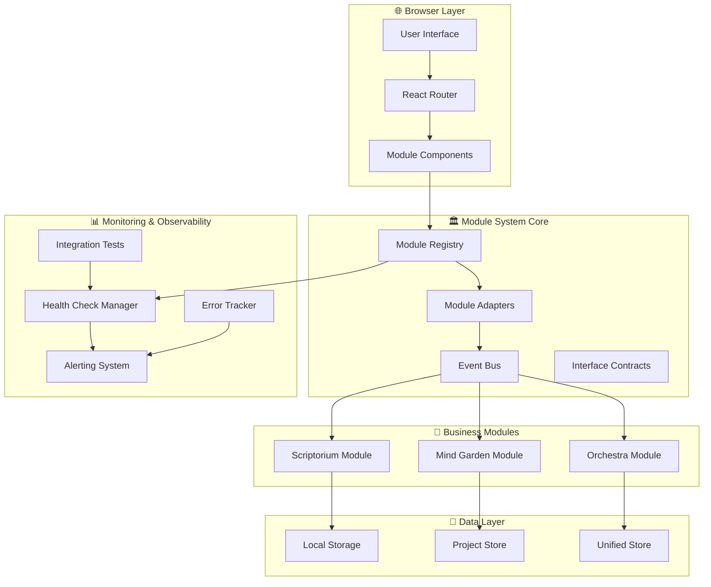

---

## 🔄 Module Communication Flow

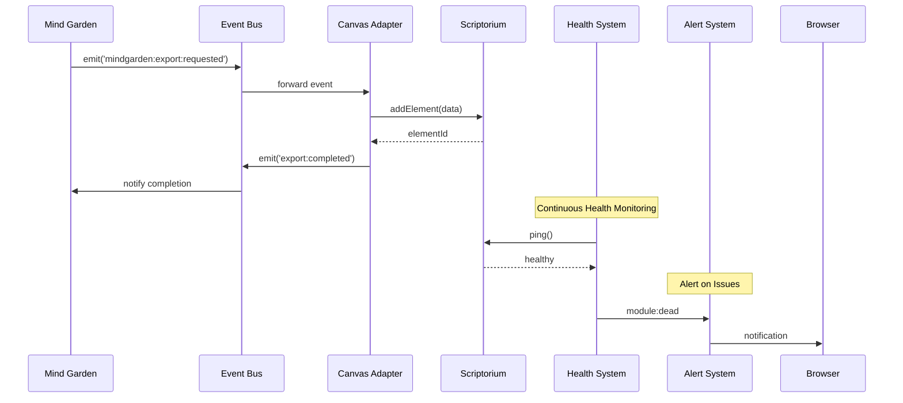

---

## 🏛️ Module Registry Architecture

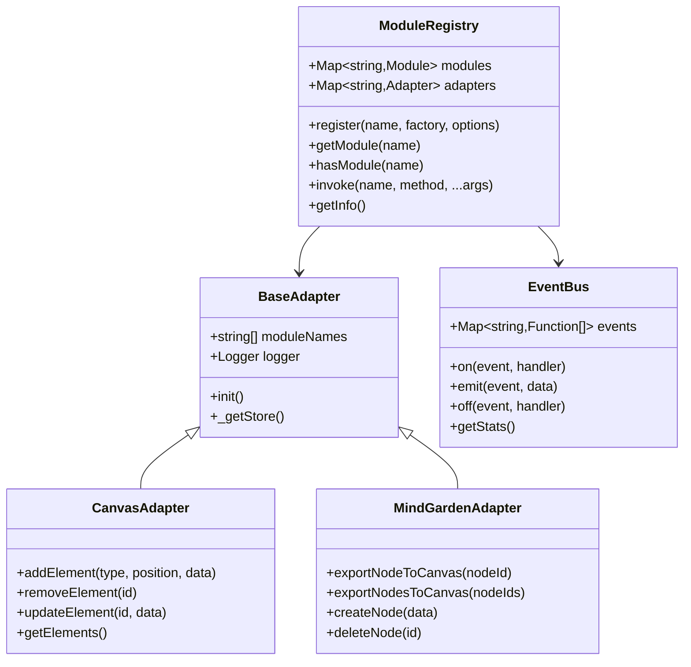

---

## 📊 Health Check System Architecture

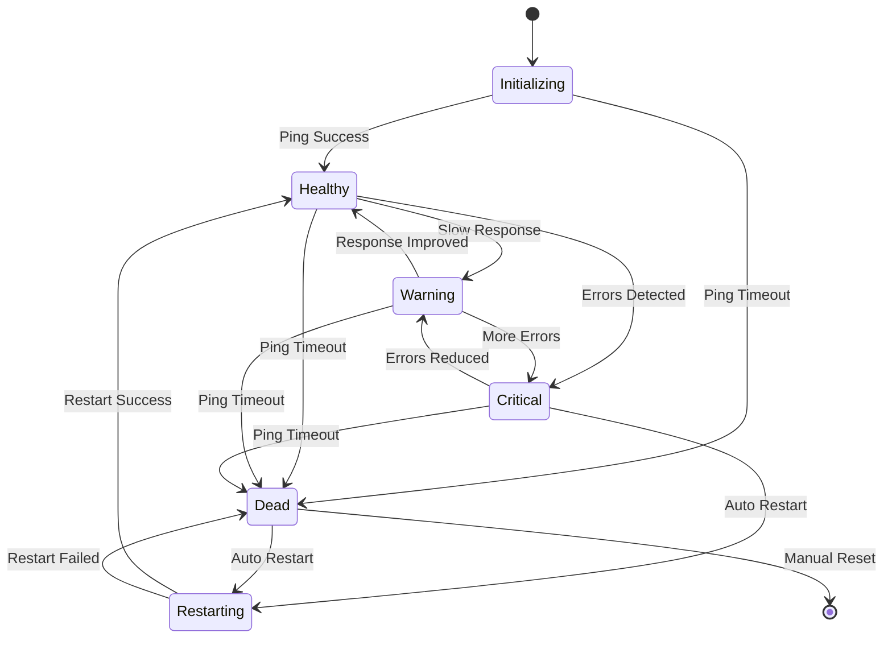

---

## 🚨 Alerting System Flow

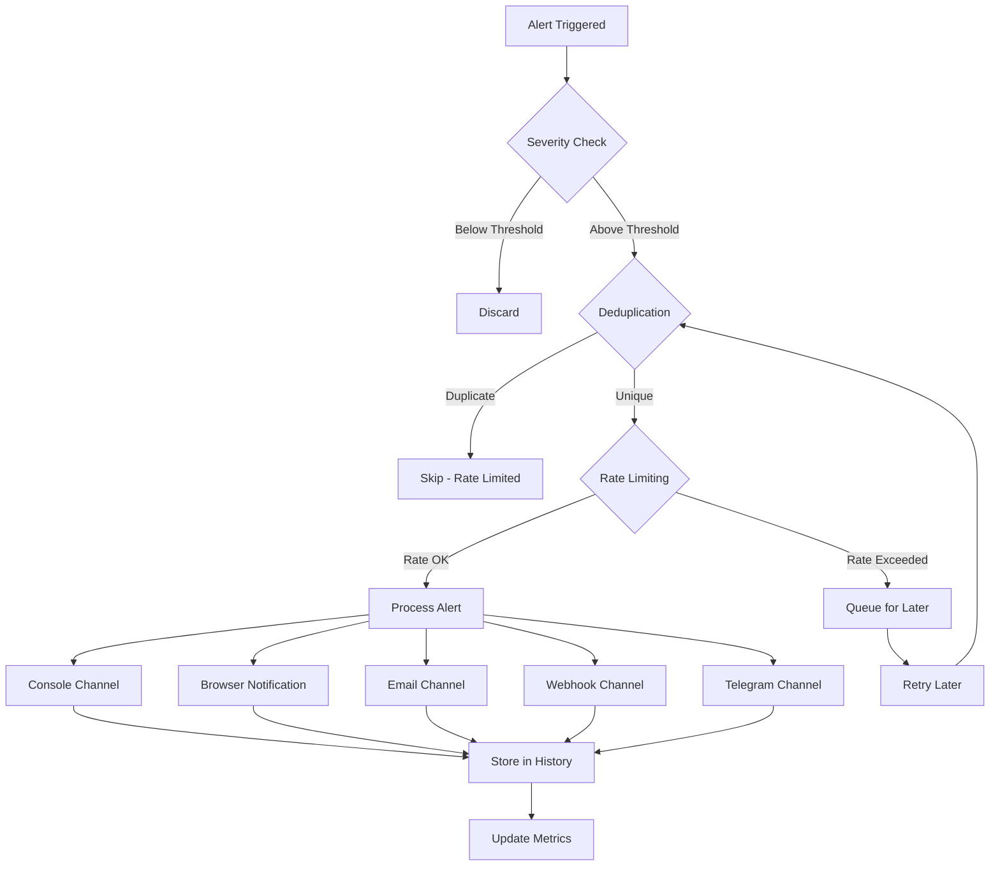

---

## 🧪 Integration Testing Architecture

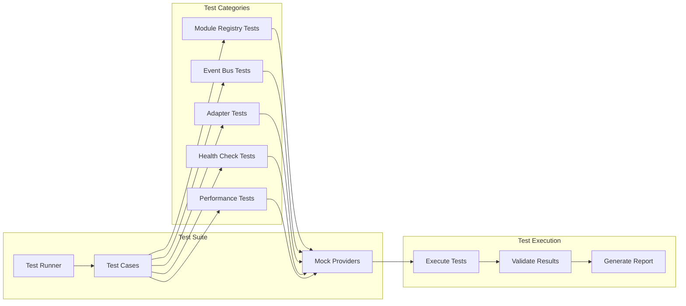

---

## 📱 User Interface Architecture

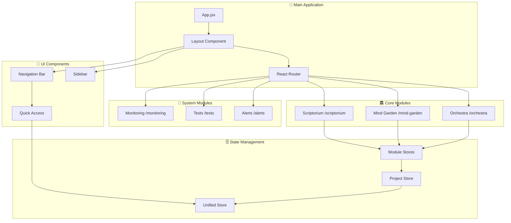

---

## 🔄 Data Flow Architecture

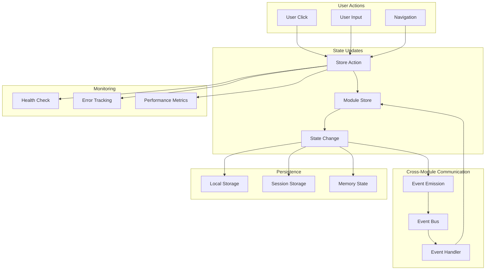

---

## 🏗️ Module Lifecycle

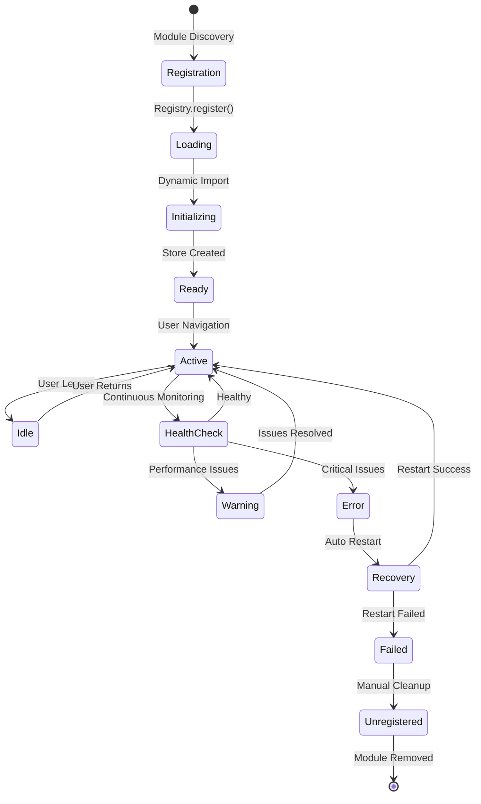

---

## 📊 Performance Monitoring

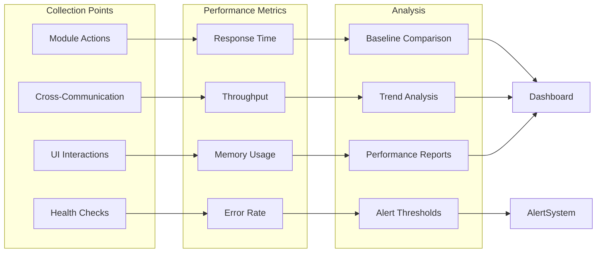

---

## 🔐 Security Architecture

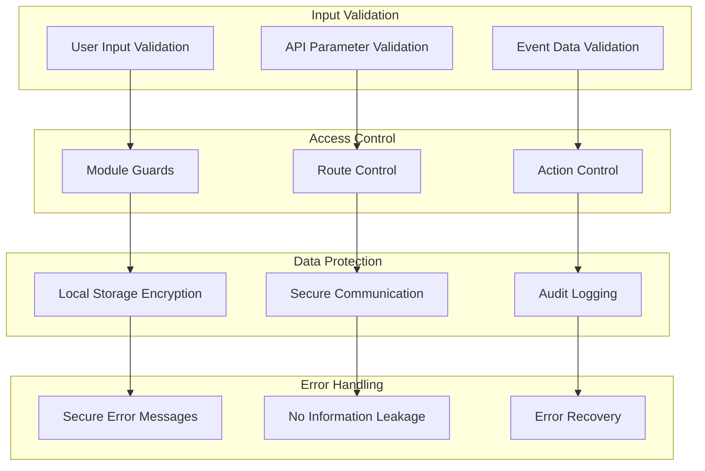

---

## 🚀 Deployment Architecture

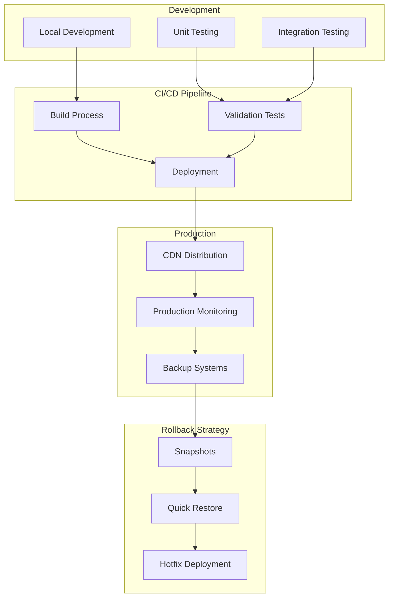

---

## 📈 Scalability Model

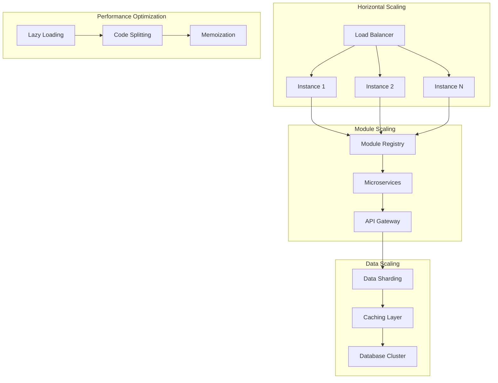

---

## 🎯 Module Interaction Matrix

| From ↓ / To → | Scriptorium | Mind Garden | Orchestra | Monitoring | Testing | Alerting |
|----------------|-------------|-------------|-----------|------------|---------|----------|
| **Scriptorium** | ✅ Internal | ⚡ Events | ⚡ Events | 📊 Health | 🧪 Tests | 🚨 Alerts |
| **Mind Garden** | 🔄 Export | ✅ Internal | ⚡ Events | 📊 Health | 🧪 Tests | 🚨 Alerts |
| **Orchestra** | 🔄 Import | 🔄 Import | ✅ Internal | 📊 Health | 🧪 Tests | 🚨 Alerts |
| **Monitoring** | 📊 Monitor | 📊 Monitor | 📊 Monitor | ✅ Internal | 🔗 Status | 🔗 Events |
| **Testing** | 🧪 Validate | 🧪 Validate | 🧪 Validate | 🔗 Report | ✅ Internal | 🚨 Results |
| **Alerting** | 🚨 Notify | 🚨 Notify | 🚨 Notify | 📊 Metrics | 🚨 Failures | ✅ Internal |

### Legend:
- ✅ **Internal**: Module self-operations
- 🔄 **Data Flow**: Cross-module data transfer
- ⚡ **Events**: Event-based communication
- 📊 **Monitoring**: Health and performance tracking
- 🧪 **Testing**: Automated validation
- 🚨 **Alerting**: Notification and alerts
- 🔗 **Integration**: System integration points

---

## 📝 Architecture Decision Records (ADRs)

### ADR-001: Module Registry Pattern
**Decision**: Use centralized module registry with adapters  
**Rationale**: Enables loose coupling and safe module replacement  
**Impact**: Zero breaking changes during module updates

### ADR-002: Event-Driven Communication
**Decision**: Implement async event bus for cross-module communication  
**Rationale**: Prevents tight coupling and circular dependencies  
**Impact**: Improved system resilience and testability

### ADR-003: Health Check System
**Decision**: Automated health monitoring with auto-recovery  
**Rationale**: Proactive issue detection and system stability  
**Impact**: Reduced downtime and improved user experience

### ADR-004: Integrated Testing Suite
**Decision**: Comprehensive integration testing with real-time execution  
**Rationale**: Ensure system reliability and catch regressions early  
**Impact**: Higher confidence in deployments and faster development

### ADR-005: Multi-Channel Alerting
**Decision**: Support multiple notification channels with rate limiting  
**Rationale**: Flexible alerting without notification spam  
**Impact**: Better incident response and reduced alert fatigue

---

*Visual Architecture Documentation v1.0.0*  
*Generated by Atelier Professional Architecture System*  
*Last Updated: 2025-07-17*