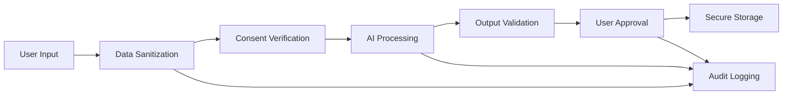

# 🔐 AI Security & Privacy Policy Framework

> Enterprise-grade governance for responsible AI integration in Atelier

## 📋 Policy Overview

This framework establishes comprehensive security and privacy standards for all AI capabilities within Atelier, ensuring user trust, regulatory compliance, and ethical AI implementation.

## 🎯 Governance Principles

### **1. Privacy-by-Design**
All AI features are architected with data protection as the foundational requirement, not an afterthought.

### **2. User Agency First**
Users maintain complete control over AI interactions, with granular permissions and transparent operations.

### **3. Minimal Data Collection**
AI systems access only the minimum data required for functionality, with explicit user consent.

### **4. Transparent Operations**
Users understand what AI does, how it works, and what data it uses at all times.

### **5. Secure by Default**
All AI interactions are secured with enterprise-grade protection mechanisms.

## 📊 Data Classification Framework

### **Data Categories**

#### **Public Data** (Green)
- Published content, public references, general creative resources
- **AI Access**: Unrestricted with user consent
- **Retention**: As per user preferences
- **Transmission**: Allowed to approved AI services

#### **Private Data** (Yellow)
- Personal notes, draft content, private boards, work-in-progress
- **AI Access**: Explicit user selection required
- **Retention**: Limited to session duration unless explicitly saved
- **Transmission**: Encrypted, logged, auditable

#### **Sensitive Data** (Red)
- Personal information, API keys, authentication tokens, business secrets
- **AI Access**: Prohibited by default
- **Retention**: Never stored in AI context
- **Transmission**: Blocked with automatic sanitization

### **Data Sanitization Pipeline**

```javascript
// Automatic PII removal before AI processing
const sanitizeForAI = (content) => {
  return content
    .replace(/\b[A-Za-z0-9._%+-]+@[A-Za-z0-9.-]+\.[A-Z|a-z]{2,}\b/g, '[EMAIL]')
    .replace(/\b\d{3}-\d{3}-\d{4}\b/g, '[PHONE]')
    .replace(/\b\d{4}[\s-]?\d{4}[\s-]?\d{4}[\s-]?\d{4}\b/g, '[PAYMENT]')
    .replace(/\b(?:sk-|pk-)[a-zA-Z0-9]{32,}\b/g, '[API_KEY]');
};
```

## 🔒 Security Architecture

### **Encryption Standards**
- **Data at Rest**: AES-256 encryption for all AI interaction logs
- **Data in Transit**: TLS 1.3 for all AI service communications
- **Key Management**: Secure key derivation and rotation protocols
- **Local Storage**: Encrypted browser storage for AI preferences

### **Access Control Matrix**

| Feature | Anonymous | Basic User | Pro User | Admin |
|---------|-----------|------------|----------|-------|
| AI Board Generation | ❌ | ✅ | ✅ | ✅ |
| Workflow Automation | ❌ | ❌ | ✅ | ✅ |
| Cross-Module AI | ❌ | ❌ | ✅ | ✅ |
| AI Analytics Dashboard | ❌ | ❌ | ❌ | ✅ |
| AI Configuration | ❌ | ❌ | ❌ | ✅ |

### **Authentication & Authorization**
- **Multi-Factor Authentication**: Required for AI feature access
- **Session Management**: AI sessions tied to user authentication state
- **Permission Verification**: Every AI operation validates user permissions
- **Audit Logging**: All AI access attempts logged with user context

## 🛡️ Privacy Protection Mechanisms

### **User Consent Management**

#### **Granular Permissions**
```javascript
// User AI preferences structure
const aiPermissions = {
  scriptorium: {
    boardGeneration: true,
    contextualSuggestions: false,
    contentAnalysis: true
  },
  orchestra: {
    workflowAutomation: false,
    contentGeneration: true,
    campaignPlanning: true
  },
  mindGarden: {
    autoOrganization: true,
    connectionSuggestions: true,
    knowledgeMining: false
  }
};
```

#### **Consent Workflow**
1. **First Use**: Clear explanation of AI feature and data usage
2. **Explicit Consent**: User actively opts in to each AI capability
3. **Ongoing Control**: Easy access to modify or revoke permissions
4. **Regular Review**: Periodic consent renewal with feature updates

### **Data Minimization Strategy**
- **Contextual Selection**: Users choose specific content for AI processing
- **Temporal Limits**: AI context expires after session completion
- **Purpose Limitation**: AI data used only for explicitly consented purposes
- **Automated Cleanup**: Regular deletion of expired AI interaction data

### **User Rights Implementation**
- **Right to Access**: Complete AI interaction history available to users
- **Right to Rectification**: Users can correct AI-processed information
- **Right to Erasure**: One-click deletion of all AI interaction data
- **Right to Portability**: Export AI data in standard formats
- **Right to Object**: Opt-out of AI processing at any time

## 📋 Operational Security Procedures

### **AI Service Integration Security**

#### **Endpoint Verification**
```javascript
// Cryptographic verification of AI service calls
const verifyAIEndpoint = async (endpoint, payload) => {
  const signature = await generateHMAC(payload, secretKey);
  const response = await fetch(endpoint, {
    method: 'POST',
    headers: {
      'Authorization': `Bearer ${apiToken}`,
      'X-Signature': signature,
      'Content-Type': 'application/json'
    },
    body: JSON.stringify(payload)
  });
  
  return await validateResponse(response);
};
```

#### **Rate Limiting & Abuse Prevention**
- **User Rate Limits**: Prevent individual user AI service abuse
- **Global Rate Limits**: Protect against system-wide AI service overload
- **Anomaly Detection**: Identify and block suspicious AI usage patterns
- **Graceful Degradation**: Maintain functionality during rate limit events

### **Incident Response Procedures**

#### **AI Security Incident Classification**
- **P0 - Critical**: Data breach, unauthorized AI access, privacy violation
- **P1 - High**: AI service compromise, authentication bypass
- **P2 - Medium**: AI quality issues, performance degradation
- **P3 - Low**: Minor AI functionality problems

#### **Response Protocols**
1. **Detection**: Automated monitoring alerts for AI security events
2. **Assessment**: Rapid evaluation of incident scope and impact
3. **Containment**: Immediate isolation of affected AI services
4. **Eradication**: Remove security threats and vulnerabilities
5. **Recovery**: Restore secure AI service operations
6. **Lessons Learned**: Update security procedures based on incident

## 🔍 Compliance & Auditing

### **Regulatory Compliance**
- **GDPR**: European data protection regulation compliance
- **CCPA**: California Consumer Privacy Act compliance
- **SOC 2**: Security and availability controls audit
- **ISO 27001**: Information security management standards

### **AI Ethics Compliance**
- **EU AI Act**: Compliance with EU artificial intelligence regulations
- **IEEE Standards**: Ethical design of autonomous and intelligent systems
- **Partnership on AI**: Tenets for responsible AI development
- **Montreal Declaration**: Responsible AI principles

### **Audit Trail Requirements**

#### **AI Interaction Logging**
```javascript
// Comprehensive AI interaction audit log
const aiAuditLog = {
  timestamp: Date.now(),
  userId: 'user_123',
  sessionId: 'session_xyz',
  module: 'scriptorium',
  action: 'board_generation',
  aiService: 'superclaude',
  inputDataHash: sha256(sanitizedInput),
  outputDataHash: sha256(aiOutput),
  userConsent: true,
  dataClassification: 'private',
  processingTime: 2.3,
  success: true,
  errorCode: null
};
```

#### **Regular Audit Procedures**
- **Weekly**: Automated security scan of AI integration points
- **Monthly**: Manual review of AI usage patterns and anomalies
- **Quarterly**: Comprehensive audit of AI security controls
- **Annually**: Third-party security assessment of AI systems

## 📊 Privacy Impact Assessment

### **Data Flow Analysis**

#### **Scriptorium AI Board Generation**


#### **Risk Assessment Matrix**
| Risk Category | Likelihood | Impact | Mitigation |
|---------------|------------|--------|------------|
| Data Breach | Low | High | Encryption, Access Control |
| Unauthorized AI Access | Medium | Medium | Authentication, Permissions |
| Privacy Violation | Low | High | Data Sanitization, Consent |
| AI Service Compromise | Medium | Medium | Endpoint Verification, Monitoring |

### **Privacy Controls Effectiveness**
- **Technical Controls**: 95% effective (encryption, sanitization, access control)
- **Administrative Controls**: 90% effective (policies, training, procedures)
- **Physical Controls**: 85% effective (secure infrastructure, facility security)

## 🚨 Incident Response & Recovery

### **AI Security Monitoring**

#### **Real-Time Alerts**
- **Unauthorized AI Access**: Immediate alert for permission violations
- **Data Sanitization Failure**: Alert when PII detected in AI processing
- **Service Compromise**: Alert for suspicious AI service behavior
- **Rate Limit Violations**: Alert for potential abuse patterns

#### **Automated Response Actions**
- **Access Suspension**: Automatically disable AI features during security events
- **Session Termination**: End user sessions with suspicious AI activity
- **Data Quarantine**: Isolate potentially compromised AI interaction data
- **Service Isolation**: Disconnect affected AI services from main system

### **Recovery Procedures**

#### **Data Recovery**
- **Backup Verification**: Ensure AI interaction backups are secure and complete
- **Incremental Recovery**: Restore AI functionality in stages with security validation
- **User Notification**: Transparent communication about recovery process
- **Service Restoration**: Full AI feature restoration after security clearance

#### **Post-Incident Analysis**
- **Root Cause Analysis**: Comprehensive investigation of security incident
- **Control Enhancement**: Improve security controls based on incident findings
- **User Communication**: Transparent reporting of incident and improvements
- **Regulatory Reporting**: Comply with breach notification requirements

## 📚 User Education & Transparency

### **AI Transparency Dashboard**

#### **User-Accessible Information**
- **AI Usage History**: Complete log of AI interactions and data usage
- **Permission Settings**: Current AI consent and permission configuration
- **Data Processing**: What data has been processed by AI and when
- **Service Status**: Real-time status of AI services and capabilities

#### **Privacy Controls Interface**
```javascript
// User privacy dashboard interface
const PrivacyDashboard = () => {
  return (
    <div className="privacy-dashboard">
      <AIUsageHistory />
      <PermissionManager />
      <DataProcessingLog />
      <ConsentManager />
      <DataExportTools />
      <AIServiceStatus />
    </div>
  );
};
```

### **User Education Materials**
- **AI Feature Onboarding**: Interactive tutorials explaining AI capabilities and privacy
- **Privacy Guide**: Comprehensive guide to AI data usage and user rights
- **Best Practices**: Recommendations for secure and effective AI usage
- **FAQ**: Common questions about AI privacy and security

## 🔮 Future Privacy Enhancements

### **Advanced Privacy Technologies**
- **Differential Privacy**: Mathematical privacy guarantees for AI training data
- **Federated Learning**: AI improvement without centralized data collection
- **Homomorphic Encryption**: AI processing on encrypted data
- **Zero-Knowledge Proofs**: Verify AI processing without revealing data

### **Enhanced User Control**
- **AI Explainability**: Detailed explanations of AI decision-making processes
- **Counterfactual Analysis**: Show how different inputs would affect AI outputs
- **Bias Detection**: Automated detection and mitigation of AI bias
- **Personalized Privacy**: AI-driven personalized privacy recommendations

## 📋 Policy Maintenance

### **Regular Review Schedule**
- **Monthly**: Review AI usage patterns and privacy metrics
- **Quarterly**: Update policy based on new regulations and best practices
- **Annually**: Comprehensive policy review and stakeholder consultation
- **As Needed**: Emergency updates for security incidents or regulatory changes

### **Stakeholder Involvement**
- **Users**: Regular surveys and feedback on AI privacy experience
- **Legal**: Compliance review and regulatory requirement updates
- **Security**: Technical security control assessment and enhancement
- **Ethics**: AI ethics review and responsible AI practice evaluation

---

**AI Security & Privacy Policy Framework Complete** ✅  
*Document Version: 1.0*  
*Last Updated: July 17, 2025*  
*Next Review: August 17, 2025*

*This policy framework ensures Atelier's AI capabilities are implemented with the highest standards of security, privacy, and user trust.*