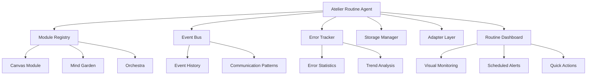

# Atelier Routine Agent - Architecture Summary

## 🎯 Overview
L'**Atelier Routine Agent** è un sistema autonomo di manutenzione per l'ecosistema Atelier che implementa pattern agentici per automazione di controlli sistema, generazione di report strutturati e recommendations actionable.

## 🏗️ Architecture Components

### 1. Core Agent (`AtelierRoutineAgent.js`)
```javascript
class AtelierRoutineAgent {
  // Autonomous system maintenance with:
  // - Comprehensive health checks
  // - Structured checklists execution
  // - Predictive recommendations
  // - Module Registry integration
}
```

### 2. Structured Checklists (`routineChecklist.js`)
```javascript
// Daily, Weekly, Critical maintenance routines
export const DailyChecklist = {
  checks: [
    { id: 'module-health', automated: true, critical: true },
    { id: 'error-count', automated: true, threshold: { maxErrors: 10 } },
    { id: 'event-flow', automated: true },
    { id: 'storage-check', automated: true },
    { id: 'backup-reminder', automated: false, requiresUserAction: true }
  ]
};
```

### 3. Visual Dashboard (`RoutineAgentDashboard.jsx`)
```jsx
// Real-time monitoring interface with:
// - System health visualization
// - Scheduled maintenance alerts
// - Quick checklist execution
// - Historical analysis
```

## 🔧 Key Features

### Automated Health Checks
- **Module Health**: Verifica Module Registry + adapters
- **Event Bus**: Controlla integrità communication patterns
- **Error Tracking**: Analizza trend errori + soglie critiche
- **Storage Health**: Monitora localStorage usage + cleanup
- **Adapter Communication**: Testa tutti gli adapter methods
- **Performance**: Analizza response times + bottlenecks

### Checklist-Based Maintenance
- **Daily**: Controlli automatici + backup reminders
- **Weekly**: Dependencies, performance, code quality
- **Critical**: Contract validation, communication tests
- **Scheduled**: Automatic maintenance due alerts

### Integration Points
- **Module Registry**: Health check per ogni modulo registrato
- **Event Bus**: Monitoring communication patterns
- **Error Tracker**: Trend analysis + statistics
- **Adapters**: Safe communication testing
- **localStorage**: Usage monitoring + cleanup

## 📊 Usage Patterns

### Console Access
```javascript
// Full system routine
window.__atelierRoutineAgent.runRoutine()

// Specific checklists
window.__atelierRoutineAgent.runChecklist('daily')
window.__atelierRoutineAgent.runChecklist('weekly')
window.__atelierRoutineAgent.runChecklist('critical')

// Individual checks
window.__atelierRoutineAgent.checkModuleHealth()
window.__atelierRoutineAgent.checkEventBus()
window.__atelierRoutineAgent.checkErrorTracking()
```

### Dashboard Access
- **URL**: `http://localhost:5173/routine`
- **Menu**: "Routine Agent" in sidebar
- **Features**: Visual monitoring, scheduled alerts, quick actions

## 🎯 Benefits

### Development
- **Proactive Monitoring**: Detect issues before they impact users
- **Automated Maintenance**: Reduce manual oversight tasks
- **Structured Reporting**: Clear, actionable insights
- **Trend Analysis**: Identify patterns in system behavior

### Production
- **System Health**: Real-time monitoring of all components
- **Predictive Maintenance**: Prevent issues before they occur
- **Performance Optimization**: Identify bottlenecks automatically
- **Error Prevention**: Proactive error trend analysis

### Enterprise
- **Autonomous Operations**: Reduce human intervention needs
- **Audit Trail**: Complete history of system checks
- **SLA Compliance**: Automated health verification
- **Scalable Architecture**: Ready for production deployment

## 🚀 Future Enhancements

### Immediate (Next Sprint)
- **Automated Remediation**: Self-healing system actions
- **Advanced Analytics**: ML-based pattern recognition
- **Load Testing**: Stress testing automation
- **Alert Integration**: Email/Slack/webhook notifications

### Medium Term
- **Predictive Maintenance**: ML-based issue prediction
- **Performance Profiling**: Detailed performance analysis
- **Automated Optimization**: System tuning recommendations
- **Cross-Module Analysis**: Deep dependency analysis

### Long Term
- **AI-Driven Insights**: Machine learning for system optimization
- **Automated Scaling**: Dynamic resource management
- **Multi-Environment**: Development, staging, production monitoring
- **Team Collaboration**: Shared maintenance workflows

## 📁 File Structure
```
webapp/src/
├── modules/shared/agents/
│   ├── AtelierRoutineAgent.js     # Core agent implementation
│   ├── routineChecklist.js        # Structured checklists
│   ├── testRoutineAgent.js        # Testing utilities
│   └── index.js                   # Exports
├── components/
│   └── RoutineAgentDashboard.jsx  # Visual interface
└── [App.jsx updates]              # Routes + menu integration
```

## 🔗 Integration Architecture



## 🏆 Achievement Summary

**Status**: ✅ **COMPLETE** - Production Ready

**Architecture**: Enterprise-grade autonomous maintenance system

**Integration**: Seamless with existing Professional Module System

**Benefits**: Proactive monitoring, automated maintenance, predictive intelligence

**Next Phase**: Advanced analytics, automated remediation, ML-driven insights

---

*Atelier Routine Agent v1.0 - Autonomous System Maintenance Complete*
*Documentation updated: 2025-07-17*